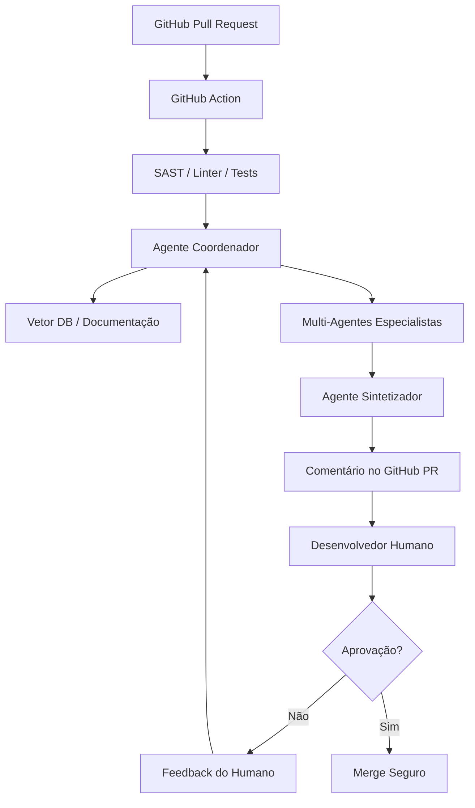

# Arquitetura Técnica: Ecossistema Avançado de Code Review com IA

Este documento descreve a arquitetura de um sistema de Code Review autônomo, integrando agentes inteligentes, RAG, ferramentas de segurança e fluxos de trabalho DevOps.

---

## 1. Visão Geral da Arquitetura Multi-Agente
O sistema utiliza um padrão **Coordinator/Dispatcher** com **Parallel Fan-Out/Gather**. Um agente central coordena especialistas focados em domínios específicos.

### Agentes Especialistas:
1.  **Agente de Segurança (Security Sentinel):** Focado em SAST, OWASP Top 10 e validação de input.
2.  **Agente de Performance (Efficiency Expert):** Focado em otimização de queries, complexidade e uso de recursos.
3.  **Agente de Estilo e Padrões (Style Guardian):** Focado em Clean Code, SOLID e padrões internos da empresa.
4.  **Agente de Contexto (Context Architect):** Responsável por buscar informações no RAG e histórico do Git.
5.  **Agente Sintetizador (Review Lead):** Consolida todos os feedbacks, remove duplicatas e gera o comentário final no GitHub.

---

## 2. Componentes Estratégicos

### A. RAG (Retrieval-Augmented Generation) para Código
O RAG não é apenas para documentos; ele serve para fornecer contexto do repositório:
-   **Knowledge Base:** Manuais de arquitetura, guias de estilo da empresa e documentação de APIs internas.
-   **Code Index:** Vetorização do código existente para que o agente saiba como padrões semelhantes foram implementados.
-   **Histórico de PRs:** Recuperação de feedbacks passados para evitar que erros antigos se repitam.

### B. Integração de Ferramentas (Tool Use)
O agente não "adivinha" problemas que ferramentas determinísticas resolvem melhor. Ele invoca:
-   **SAST:** Semgrep ou CodeQL para encontrar vulnerabilidades conhecidas.
-   **Linters:** ESLint/Pylint para garantir conformidade básica antes da análise semântica.
-   **Test Runner:** Executa testes unitários nas sugestões de correção antes de propô-las.

### C. Integração GitHub & CI/CD
O fluxo é totalmente automatizado via GitHub Actions:
1.  **Trigger:** Pull Request aberto ou atualizado.
2.  **Pipeline:**
    -   Checkout do código.
    -   Execução de ferramentas estáticas (SAST/Lint).
    -   Chamada do Orquestrador de Agentes (passando o Diff + Resultados das ferramentas).
    -   Publicação de comentários inline no PR.
    -   Atualização do Status Check do GitHub (Success/Failure).

---

## 3. Fluxo de Trabalho e Human-in-the-Loop (HITL)

O sistema opera em um modelo de **Co-piloto**, não de substituição total:
-   **Interação:** O desenvolvedor pode responder a um comentário do agente. O agente processa a resposta e pode reconsiderar ou explicar melhor.
-   **Aprovação:** O agente nunca faz o "Merge" sozinho. Ele apenas fornece o selo de "Aprovado" ou "Solicitar Alterações" com base em critérios técnicos.
-   **Feedback Loop:** Se um humano rejeitar um comentário do agente, esse evento é logado para refinar os prompts ou a base do RAG.

---

## 4. Observabilidade e Controle

### Mecanismos de Custo e Segurança:
-   **Token Budgeting:** Limite de tokens por PR para evitar custos explosivos em diffs gigantescos.
-   **Data Masking:** Antes de enviar o código para o LLM, o sistema remove segredos (API Keys, senhas) detectados por ferramentas como Gitleaks.
-   **Audit Log:** Registro de todas as decisões do agente, ferramentas utilizadas e tempo de resposta.

### Observabilidade:
-   **Dashboard:** Acompanhamento da taxa de aceitação de comentários (Precision/Recall).
-   **Tracing:** Visualização do fluxo de pensamento entre os multi-agentes (ex: usando LangSmith ou Phoenix).

---

## 5. Diagrama de Fluxo (Conceitual)

