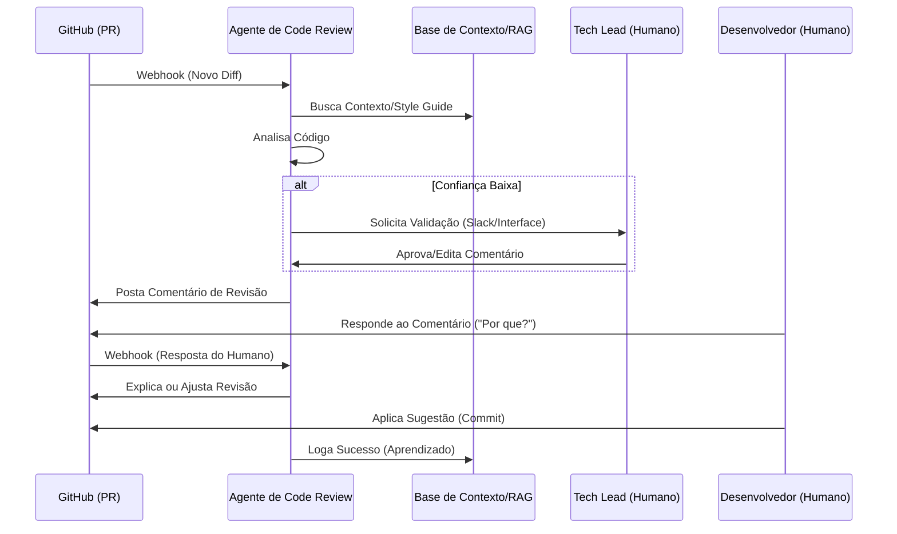

# Detalhamento Técnico: Fluxo de Dados e Human-in-the-Loop (HITL)

Este documento detalha como os dados se movem no sistema e como a interação humana é integrada para garantir qualidade e aprendizado contínuo.

---

## 1. Diagrama de Fluxo de Dados (DFD) - Nível 2

O fluxo de dados segue um ciclo de vida desde o evento no GitHub até o feedback final do desenvolvedor.

### Fluxo de Entrada e Processamento:
1.  **Evento (Webhook):** O GitHub envia um payload (JSON) contendo metadados do PR, o Diff e informações do autor.
2.  **Pré-processamento:**
    -   **Secret Scanner:** Filtra segredos (API keys) do Diff.
    -   **Context Fetcher:** Busca arquivos relacionados no repositório para prover contexto (arquivos importados, interfaces, etc.).
    -   **RAG Retrieval:** Consulta a base vetorial em busca de padrões de arquitetura e guias de estilo.
3.  **Orquestração de Agentes:**
    -   Os dados processados são enviados para o **Orquestrador**.
    -   O Orquestrador distribui sub-tarefas para os especialistas (Segurança, Performance, Estilo).
4.  **Sintetização:** Os relatórios dos agentes são agregados e formatados.

### Fluxo de Saída e Feedback:
5.  **Publicação:** O comentário é postado via GitHub API.
6.  **Interação Humana:** O desenvolvedor interage com o comentário (Aceita, Rejeita ou Comenta).
7.  **Loop de Aprendizado:** As interações são capturadas e enviadas para uma base de dados de observabilidade para ajuste fino futuro.

---

## 2. Mecanismo de Human-in-the-Loop (HITL)

O HITL neste sistema não é apenas uma aprovação passiva, mas uma colaboração ativa dividida em três camadas:

### Camada 1: Interação Direta (Conversacional)
O desenvolvedor pode "conversar" com o agente no próprio PR do GitHub.
-   **Ação:** O desenvolvedor responde a um comentário do agente: *"Este ponto de performance não se aplica aqui porque o volume de dados é fixo em 10 itens."*
-   **Reação do Agente:** O sistema detecta a menção (@agente), reprocessa o contexto com a nova informação e responde: *"Entendido. Dado que o volume é fixo, a complexidade O(n^2) é aceitável. Vou desconsiderar este ponto para este PR."*

### Camada 2: Triage e Validação (Intervenção)
Antes de postar comentários críticos ou bloquear um merge, o sistema pode solicitar uma revisão de um "Tech Lead" humano através de uma interface de controle.
-   **Ação:** O agente identifica uma falha de segurança grave, mas tem baixa confiança (ex: < 70%).
-   **Mecanismo:** Em vez de postar no PR, ele envia um alerta para um canal de Slack/Teams com um botão: `[Validar Comentário] | [Ignorar]`.
-   **HITL:** O humano valida, e só então o comentário aparece no PR.

### Camada 3: Feedback Implícito e Aprendizado
O sistema monitora o destino de cada comentário postado.
-   **Sinal Positivo:** O desenvolvedor faz o commit sugerido pelo agente.
-   **Sinal Negativo:** O desenvolvedor marca o comentário como "Resolvido" sem alterar o código, ou clica em uma reação de "Polegar para baixo".
-   **Mecanismo de Controle:** Esses dados alimentam um pipeline de **Reinforcement Learning from Developer Feedback (RLDF)**, onde o RAG e os prompts dos agentes são ajustados para reduzir falsos positivos.

---

## 3. Matriz de Controle de Estado

| Estado do Agente | Ação do Humano Requerida | Impacto no Sistema |
| :--- | :--- | :--- |
| **Confiança Alta (>90%)** | Nenhuma (Postagem Direta) | Alta velocidade de revisão. |
| **Confiança Média (70-90%)** | Revisão Opcional (Flag "Review Needed") | Melhora a precisão sem travar o fluxo. |
| **Confiança Baixa (<70%)** | Aprovação Obrigatória (HITL Gate) | Evita "alucinações" e ruído no PR. |
| **Conflito entre Agentes** | Arbitragem Humana | Define prioridades arquiteturais. |

---

## 4. Diagrama de Sequência (HITL)

